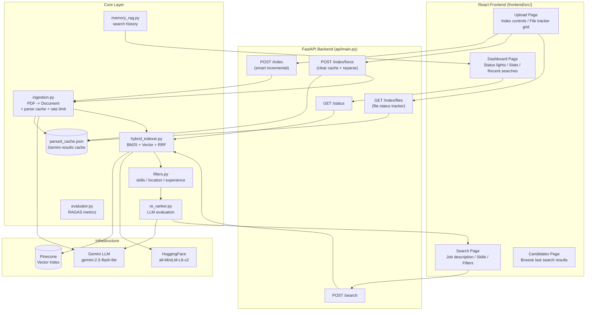
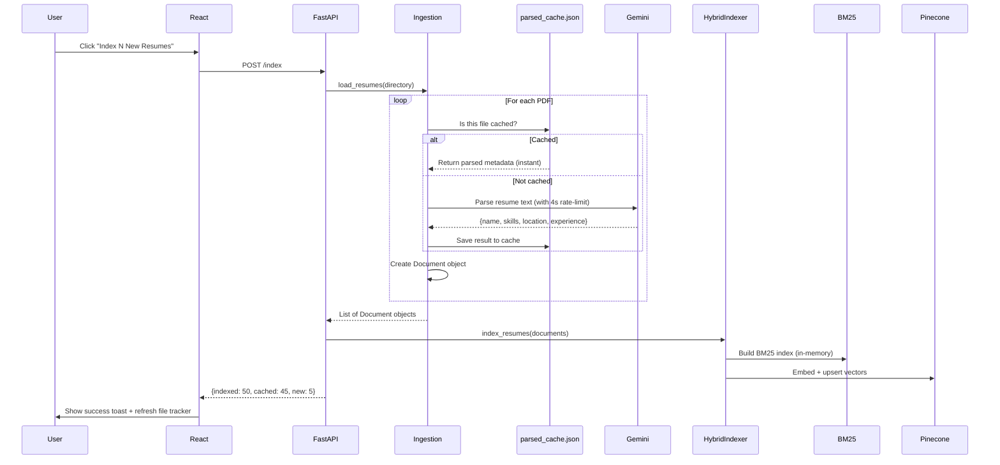
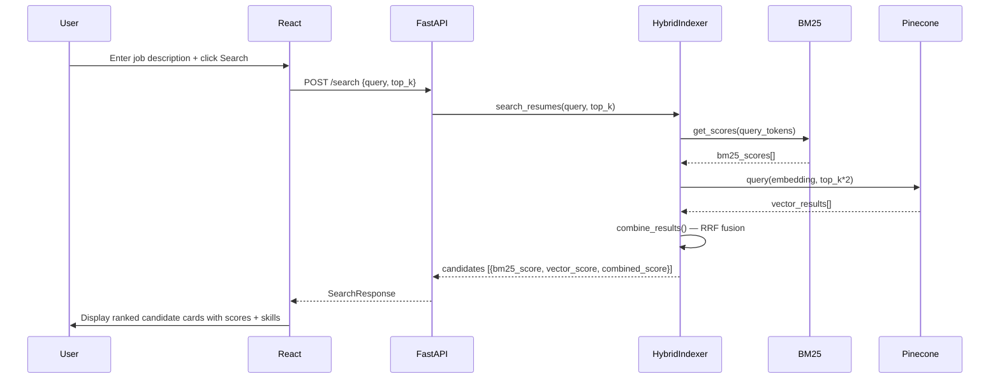
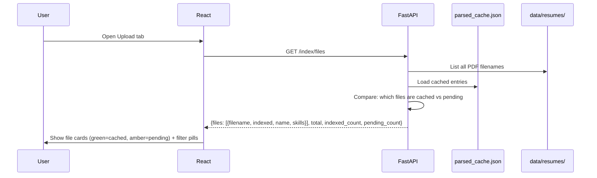

# HireFlow System Architecture

## Overview

HireFlow is a resume-only AI candidate search engine. It indexes PDF resumes using both BM25 (lexical) and Pinecone vector (semantic) search, fuses results with Reciprocal Rank Fusion (RRF), applies post-search filters, and optionally re-ranks candidates with a Gemini LLM evaluator.

The system is split into a **FastAPI backend** (handles indexing, caching, and search), a **React frontend** (modern dashboard SPA), and a legacy **Streamlit frontend**. Both frontends connect to the same API.

---

## System Diagram



---

## Data Flow — Indexing



---

## Data Flow — Searching



---

## Data Flow — File Status Tracking



---

## Caching & Rate Limiting Architecture

```
data/resumes/
├── alice_smith.pdf          ──> cached in parsed_cache.json ──> INSTANT load
├── bob_jones.pdf            ──> cached in parsed_cache.json ──> INSTANT load
├── new_candidate.pdf        ──> NOT in cache ──> Gemini call (4s delay) ──> save to cache
└── another_new.pdf          ──> NOT in cache ──> Gemini call (4s delay) ──> save to cache

parsed_cache.json:
{
  "alice_smith.pdf": {
    "candidate_id": "c_alice_smith",
    "name": "Alice Smith",
    "skills": ["Python", "SQL", "AWS"],
    "location": "New York",
    "experience": 5
  },
  "bob_jones.pdf": { ... }
}

Rate limiting:
  - 4 seconds between Gemini calls (~15 RPM, within free tier)
  - On 429 error: retry with 30s / 60s / 90s exponential backoff
  - Max 3 retries per file, then fallback to basic metadata
```

---

## Scoring Pipeline

```
Resume text
    |
    +---> BM25 (rank_bm25)
    |         BM25 raw score
    |         normalized to [0,1]: score / max_score
    |
    +---> Pinecone (cosine similarity)
              Vector score in [0,1]
    |
    v
Reciprocal Rank Fusion (RRF)
    rrf_score = 1 / (60 + rank)
    candidates in both lists get scores summed
    |
    v
combined_score (RRF) -- used for initial ranking
    |
    v
Post-Search Filters (optional)
    skills / location / min_experience
    |
    v
LLM Re-Ranking (optional, top-5 only)
    fit_score = 50 + strength_score(max 30) - gap_penalty(max 40)
    clamped to [0, 100]
```

---

## API Endpoints

| Method | Path | Purpose | Response |
|---|---|---|---|
| `POST` | `/index` | Smart incremental index (only new files) | `{indexed, cached, new, message}` |
| `POST` | `/index/force` | Clear cache + re-parse everything | `{indexed, cached, new, message}` |
| `GET` | `/index/files` | List all PDFs with cached/pending status | `{files[], total, indexed_count, pending_count}` |
| `POST` | `/search` | Hybrid BM25+Vector search | `{results[{candidate_id, name, scores, skills}], total}` |
| `GET` | `/status` | System health check | `{resumes_ready, vector_store_ready, hybrid_ready, pinecone_vector_count}` |

---

## Component Descriptions

| Component | File | Responsibility |
|---|---|---|
| FastAPI Backend | `api/main.py` | 5 REST endpoints for index/search/status/files |
| HybridIndexer | `core/hybrid_indexer.py` | Orchestrates BM25 + Pinecone + RRF |
| VectorStore | `core/vector_store.py` | Pinecone upsert and query |
| Ingestion | `core/ingestion.py` | PDF -> Document + cache + rate-limit + retry |
| Parse Cache | `data/parsed_cache.json` | Stores Gemini parse results to avoid re-parsing |
| ResumeParser | `core/parsing.py` | LLM-based structured field extraction |
| ReRanker | `core/re_ranker.py` | Gemini evaluation with weighted scoring |
| Filters | `core/filters.py` | Post-search filtering (skills/location/exp) |
| MemoryRAG | `core/memory_rag.py` | LangChain conversation memory |
| SearchRouter | `core/search_router.py` | Routes to shallow or deep search strategy |
| RAGEvaluator | `core/evaluator.py` | RAGAS quality metrics |
| React Frontend | `frontend/src/` | Modern dashboard with 4 pages |

---

## React Frontend Architecture

```
frontend/src/
├── App.js                  # Global state: indexing, status, toasts, search results
├── App.css                 # All styles (single file)
│
├── services/
│   └── api.js              # fetchStatus, triggerIndex, forceIndex, fetchFileList, searchCandidates
│
├── components/
│   ├── Sidebar.js          # Left nav + connection status lights (API/Vector/Search)
│   ├── TopBar.js           # Header tabs + indexing progress pill
│   ├── StatCards.js        # 4 metric cards with glow status dots
│   ├── CandidateCard.js    # Expandable result card (scores, skills, details)
│   ├── ToastContainer.js   # Notification system
│   └── Spinner.js          # Loading indicators
│
└── pages/
    ├── DashboardPage.js    # System overview, status lights, recent searches, quick actions
    ├── SearchPage.js       # Search form -> POST /search -> display ranked results
    ├── UploadPage.js       # Index controls, summary stats, file tracker grid
    └── CandidatesPage.js   # Browse candidates from last search
```

**Key design decisions:**
- **Indexing state lives in App.js** — persists across tab switches, shows banner on all pages
- **Status polling every 10s** — keeps connection lights and stats current
- **File tracker uses GET /index/files** — shows cached vs pending with filter pills
- **lucide-react icons** — consistent, beautiful iconography throughout

---

## Re-Ranker Scoring Detail

### LLM path (Gemini available)
```
1. Gemini extracts: 3 strengths, 3 gaps, any risks, summary
2. For each item in strengths/gaps:
   - positional_weight = (n - i) / n  (first item = highest weight)
   - skill_match_weight = positional bonus if item matches a required skill
   - experience_bonus = +0.2 if item mentions "experience"/"years"/"senior"
3. strength_score = aggregate(strengths, max=30, is_gap=False)
4. gap_penalty   = aggregate(gaps, max=40, is_gap=True)
5. fit_score = clamp(50 + strength_score - gap_penalty, 0, 100)
```

### Fallback path (LLM unavailable)
```
fit_score = 50 + (20 * n_strengths) - (15 * n_gaps)
clamped to [0, 100]
```

---

## Startup Behaviour

### FastAPI Backend
1. Lazily initializes `HybridIndexer` on first request
2. HybridIndexer connects to Pinecone on init

### React Frontend
1. Polls `GET /status` every 10 seconds
2. Shows connection status lights (green/red glow dots)
3. Upload page loads `GET /index/files` to show file tracker

### Indexing (POST /index)
1. Loads `parsed_cache.json`
2. Scans `data/resumes/` for all PDFs
3. Cached files: load metadata instantly, create Documents
4. New files: call Gemini (4s rate-limit), save to cache, create Documents
5. Index ALL Documents into BM25 + Pinecone
6. Return counts: `{indexed, cached, new}`

### Force Re-index (POST /index/force)
1. Deletes `parsed_cache.json`
2. Runs full indexing (all files treated as new)

---

## Running Tests

```bash
pytest tests/ -v
```

All tests use `unittest.mock` — no live Pinecone or Gemini calls.

| Test file | Covers |
|---|---|
| `tests/test_filters.py` | skills / location / experience filtering |
| `tests/test_hybrid_indexer.py` | BM25 indexing, RRF fusion, score normalization |
| `tests/test_re_ranker.py` | LLM evaluation, rule-based fallback, section parsing |
| `tests/test_ingestion.py` | PDF loading, metadata extraction, DocumentProcessor |
